<div align="center">

# GRAIL: Generating Humanoid Loco-Manipulation from 3D Assets and Video Priors

<p>
  <a href="https://research.nvidia.com/labs/dair/grail/">
    
  </a>
  <a href="https://arxiv.org/pdf/2606.05160">
    
  </a>
  <a href="https://nvlabs.github.io/GRAIL/">
    
  </a>
  <a href="https://huggingface.co/datasets/nvidia/PhysicalAI-Robotics-Locomanipulation-GRAIL">
    
  </a>
</p>


</div>

**GRAIL** is a fully digital data-generation pipeline for humanoid loco-manipulation. It composes 3D assets, simulator-ready scenes, robot-proportioned characters, and video foundation model priors to synthesize metric 4D human-object interaction (HOI) trajectories, then retargets them to a Unitree G1 and trains task-general policies for pick-up, whole-body manipulation, sitting, and terrain traversal. Using only GRAIL-generated data, the resulting egocentric visual policies transfer to real-world object pick-up and stair-climbing.

## Motion Gallery

| Tabletop Pickup | Ground Pickup |
|:---:|:---:|
| 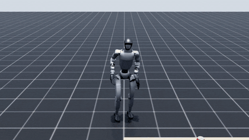 | 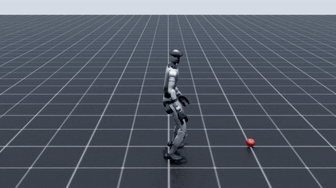 |

| Tabletop Manipulation | Ground Manipulation |
|:---:|:---:|
| 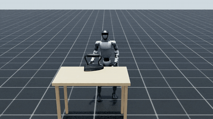 | 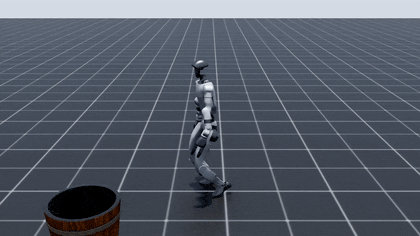 |

| Sitting | Curb |
|:---:|:---:|
| 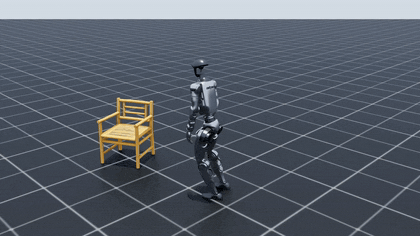 | 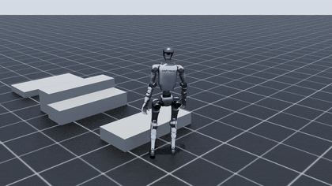 |

| Slope | Stairs |
|:---:|:---:|
| 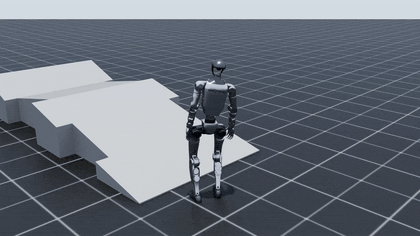 | 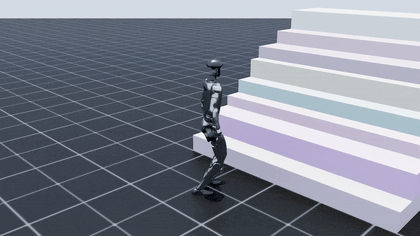 |

## Sim-to-Real Deployment

**Rendered Egocentric Views**

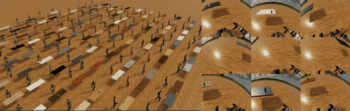

| Pick-up | Stair-Climbing |
|:---:|:---:|
| 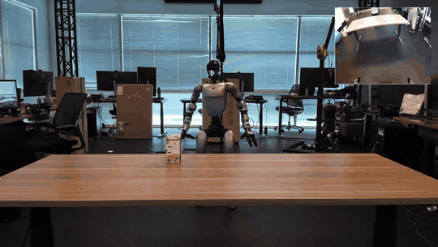 | 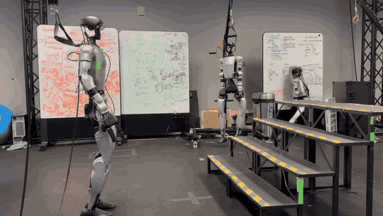 |

## Quick Start

**Pull the docker image** and install local extras inside the bind-mounted checkout:

```bash
git clone https://github.com/NVlabs/GRAIL.git
cd GRAIL
git submodule update --init --recursive

docker pull docker.io/nvgrail/grail:latest

docker run --gpus all -it --shm-size=16g \
    -v "$PWD":/workspace/grail \
    docker.io/nvgrail/grail:latest

# inside the container
cd /workspace/grail
bash scripts/setup/install_env_docker.sh   # validates native extensions, downloads Blender
bash scripts/setup/download_checkpoints.sh # GEM-SMPL / GEM-SOMA / FoundationPose weights
bash scripts/setup/download_comasset.sh --category cordless_drill # quick-start object
source /root/miniconda3/etc/profile.d/conda.sh
conda activate grail
[ -f .env ] && source .env                  # OPENAI_API_KEY, KLING_*, HF_TOKEN
```

The setup script rebuilds GPU/Python-specific native extensions when needed
(`nvdiffrast`, FoundationPose `mycpp`) and installs Blender into the mounted
checkout.

Run any stage end-to-end. Pipeline stages are package entrypoints; invoke them
with `python -m grail.pipelines.*` rather than project-root wrapper scripts.

```bash
# 3D asset generation (procedural terrain or AI-generated objects)
python -m grail.pipelines.gen_terrain --type stairs --num 50 --output_dir data/syn_stairs
conda run -n hunyuan python -m grail.pipelines.gen_3d_assets \
    -i configs/gen_3d/example_objects.yaml -o data/gen_example

# 2D HOI generation (Blender + Kling video)
python -m grail.pipelines.gen_2dhoi --dataset ComAsset --category cordless_drill \
    --character kid --results_dir results --video_model_api kling-ai

# 4D HOI reconstruction
python -m grail.pipelines.recon_4dhoi --dataset ComAsset --category cordless_drill --results_dir results
```

Full install, dataset, and config notes: see [Documentation](#documentation) below.

## Documentation

Full documentation can be found at [docs](https://nvlabs.github.io/GRAIL/)
(rendered HTML) and markdown sources are linked below.

### Getting Started
- [Installation](docs/source/installation.md)
- [Quick Start](docs/source/quick_start.md)

### Pipeline
- [3D Asset Generation](docs/source/gen_3d_assets.md)
- [2D HOI Generation](docs/source/gen_2dhoi.md)
- [4D HOI Reconstruction](docs/source/recon_4dhoi.md)
- [Retargeting](docs/source/retargeting.md)
- [Task General Tracking](docs/source/tracking.md)
- [Data Export](docs/source/data_export.md)
- [Data Visualization](docs/source/visualization.md)
- [Web Visualizer](docs/source/web_visualizer.md)

## TODOs

- [x] Release task-general tracking policy checkpoints
- [ ] Provide quick-start demo script
- [ ] Release GRAIL manipulation dataset

## Citation

If you find GRAIL useful in your research, please cite:

```bibtex
@misc{grail2026,
  title         = {GRAIL: Generating Humanoid Loco-Manipulation from 3D Assets and Video Priors},
  author        = {Tianyi Xie and Haotian Zhang and Jinhyung Park and Zi Wang and Bowen Wen and Jiefeng Li and Xueting Li and Qingwei Ben and Haoyang Weng and Yufei Ye and David Minor and Tingwu Wang and Chenfanfu Jiang and Sanja Fidler and Jan Kautz and Linxi Fan and Yuke Zhu and Zhengyi Luo and Umar Iqbal and Ye Yuan},
  year          = {2026},
  eprint        = {2606.05160},
  archivePrefix = {arXiv},
  primaryClass  = {cs.RO},
  doi           = {10.48550/arXiv.2606.05160},
  url           = {https://arxiv.org/abs/2606.05160},
}
```

## License

This project is released under the NVIDIA License; see [LICENSE](LICENSE) for details. The Work and any derivative works may be used only non-commercially, except by NVIDIA Corporation and its affiliates. Third-party components are subject to their own licenses.
